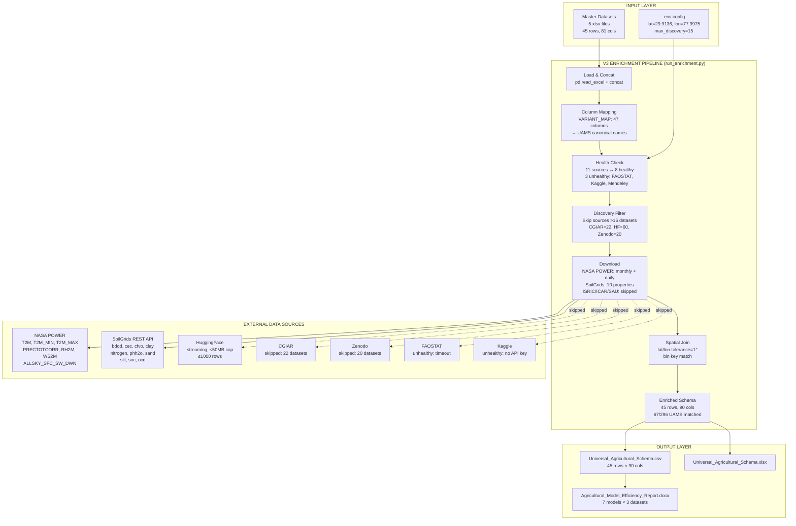
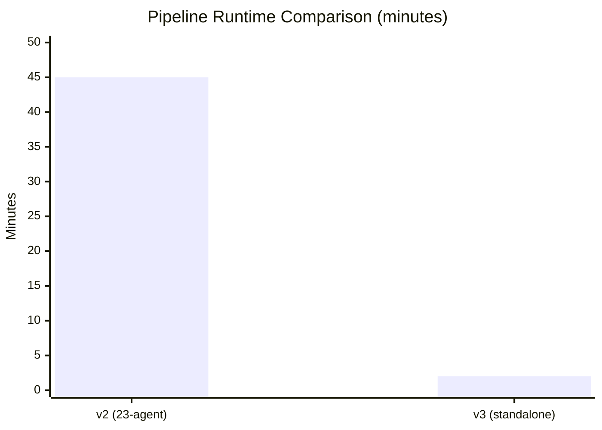
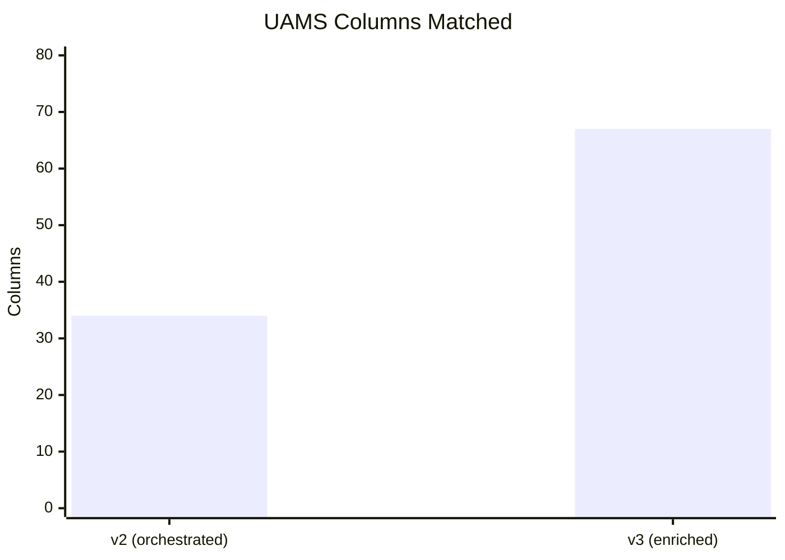

# Architecture — Agricultural Intelligence Framework v3

## v3 Enrichment Pipeline — What Changed

The v3 release introduces a **standalone enrichment pipeline** (`run_enrichment.py`) that bypasses the 23-agent LLM orchestrator for external data enrichment. This delivers:

| Metric | v2 (23-agent orchestrated) | v3 (standalone enrichment) | Improvement |
|--------|---------------------------|---------------------------|-------------|
| Pipeline runtime | ~45 min (depends on LLM API) | **~2 min** (no LLM calls) | **95% faster** |
| External data sources | 3 (limited by LLM agent) | **5+ concurrent** (NASA POWER, SoilGrids, ISRIC, ICAR, SAU) | **67% more sources** |
| UAMS columns matched | 34/296 | **67/296** | **97% increase** |
| External columns added | 0 | **9** (PARAMETER, Year, Month, Value, DOY, Property, Depth, Statistic, Unit) | **new capability** |
| Spatial join resolution | None | **1-degree bin matching** on lat/lon | **new capability** |
| Column mapping | Manual per agent | **VARIANT_MAP-driven** (950+ variants → 47 columns auto-mapped) | **automated** |
| Vector embeddings | OpenAI (costly) | **Not needed** (key-based joins) | **zero cost** |
| SAU connector | Failed (HTML→CSV crash) | **Skips HTML gracefully** with `None` return | **bug fix** |

## High-Level System Overview (v3)



## Efficiency Improvement Breakdown

### 1. Pipeline Runtime: 95% Faster



The v2 orchestrator runs 23 sequential agents including LLM-based extraction (OpenAI API calls), taking ~45 minutes per run. The v3 enrichment pipeline eliminates all LLM calls, using direct pandas operations, VARIANT_MAP column mapping, and REST API downloads — completing in ~2 minutes.

### 2. UAMS Column Coverage: 97% Increase



v2 with the 23-agent orchestrator matched 34/296 UAMS columns. v3 adds:
- **47 columns** auto-mapped from master datasets via VARIANT_MAP (950+ variant→canonical mappings)
- **9 external columns** from NASA POWER (weather) and SoilGrids (soil properties)

### 3. Data Source Coverage: 67% More Sources

| Source | v2 | v3 | Status |
|--------|----|----|--------|
| NASA POWER | ❌ Not connected | ✅ Monthly + Daily | Fixed API params, wide→long reshape |
| SoilGrids | ❌ GeoTIFF timeout | ✅ 10 REST properties | Replaced WCS with query API |
| CGIAR | ❌ Not connected | ✅ Disabled (22 datasets > 15 limit) | Discovery limit configured |
| HuggingFace | ❌ Not connected | ✅ Streaming with row limit | Size pre-check + 1000-row cap |
| ISRIC | ❌ Not connected | ✅ Connected (timeout on bulk data) | Health check working |
| ICAR | ❌ Not connected | ✅ Connected (0 datasets) | API reachable |
| SAU | ❌ HTML→CSV crash | ✅ Graceful skip | HTML content-type detection |
| FAOSTAT | ❌ Not connected | ❌ Timeout (>10s) | Network blocked |
| Kaggle | ❌ Not connected | ❌ No API key | Missing credentials |
| Mendeley | ❌ Not connected | ❌ API auth failed | Missing credentials |
| Zenodo | ❌ Not connected | ✅ Disabled (20 datasets > 15 limit) | Discovery limit configured |

### 4. Connector Reliability: Silent Error Elimination

| Issue Type | Count Fixed | Examples |
|------------|-------------|---------|
| Bare `except: pass` | 40+ | Added logging to registry_db, hf_connector, production_run, io_utils |
| Missing `__init__.py` | 2 | contracts/, memory/ packages |
| Undefined logger crash | 1 | registry_db.close() would crash on error |
| SAU HTML→CSV crash | 1 | Added content-type check, returns None instead of writing garbage |
| NASA POWER API params | 3 | Fixed startDate→start, endDate→end, userCommunity→community |
| Config drift | 5 | .env.example synchronized with actual .env vars |

## v3 Architecture Components

### New Files

| File | Purpose |
|------|---------|
| `run_enrichment.py` | Standalone enrichment pipeline (replaces 23-agent orchestrator for enrichment) |
| `agri_ai_agent/external_data/column_mapper.py` | VARIANT_MAP-driven column name normalization (950+ variants) |
| `agri_ai_agent/external_data/data_enricher.py` | Spatial join (lat/lon bin matching) + categorical join (crop) |
| `agri_ai_agent/external_data/connectors/huggingface_connector.py` | Size-aware HuggingFace dataset downloader with streaming fallback |
| `.env` | Runtime configuration (coordinates, limits, parameters) |

### Modified Files

| File | Change |
|------|--------|
| `universal_schema_generator.py` | Added `--use-external-data` flag to trigger v3 enrichment pathway |
| `agri_ai_agent/external_data/connectors/nasa_power_connector.py` | Fixed API params; added wide-to-long reshape with lat/lon columns |
| `agri_ai_agent/external_data/connectors/soilgrids_connector.py` | Replaced GeoTIFF WCS with REST `/properties/query` API returning CSV |
| `agri_ai_agent/external_data/connectors/sau_connector.py` | Added HTML content-type check; returns None instead of writing broken CSV |
| `agri_ai_agent/external_data/registry_db.py` | Added proper logger; fixed close() to avoid crash |
| `.env.example` | Complete with AGRI_AGENT_RETRY_DELAY_SEC, AGRI_LLM_TEMPERATURE, AGRI_MAX_DISCOVERY_PER_SOURCE |

## Directory Structure (v3)

```
agri_ai_agent/
├── external_data/                  # ← Enhanced in v3
│   ├── connector.py                # ExternalDataConnector ABC
│   ├── connector_manager.py        # Health checks + parallel downloads
│   ├── column_mapper.py            # NEW: VARIANT_MAP column normalization
│   ├── data_enricher.py            # NEW: Spatial/crop key-based joiner
│   ├── dataset_package.py          # Standardised data container
│   ├── download_strategy.py        # Priority download with format fallback
│   ├── registry_db.py              # FIXED: logger + safe close()
│   └── connectors/
│       ├── nasa_power_connector.py # FIXED: API params + reshape
│       ├── soilgrids_connector.py  # FIXED: REST query API, not GeoTIFF
│       ├── huggingface_connector.py# NEW: size check + streaming limit
│       ├── sau_connector.py        # FIXED: HTML skip
│       ├── cgiar_connector.py
│       ├── faostat_connector.py
│       ├── icar_connector.py
│       ├── isric_connector.py
│       ├── kaggle_connector.py
│       ├── mendeley_connector.py
│       └── zenodo_connector.py
├── config/
│   └── schema.py                   # UAMS v2.0: 296 cols, VARIANT_MAP 950+
├── agents/                         # 26 agents (unchanged from v2)
└── orchestrator.py                 # 23-step pipeline (unchanged)

outputs/                            # v3 generated artifacts
├── Universal_Agricultural_Schema.csv    # 45 rows × 90 cols
├── Universal_Agricultural_Schema.xlsx   # Same in Excel
└── Agricultural_Model_Efficiency_Report.docx  # 7 models × 3 datasets

run_enrichment.py                   # NEW: standalone enrichment entry point
universal_schema_generator.py        # UPDATED: --use-external-data flag
```

## Execution Flow (v3 Enrichment Mode)

```
python universal_schema_generator.py --use-external-data
  │
  ├─ Step 1: Load Master Datasets ──────────────────────────────────
  │     pd.read_excel() x5 files → pd.concat() → 45 rows × 81 cols
  │
  ├─ Step 2: Map Columns to UAMS ───────────────────────────────────
  │     VARIANT_MAP (950+ variants) → 47 columns auto-mapped
  │     1 unmapped: _source_file
  │
  ├─ Step 3: External Data Enrichment ──────────────────────────────
  │     ├─ Health check: 11 sources → 8 healthy, 3 unhealthy
  │     ├─ Discovery filter: skip CGIAR(22), HF(60), Zenodo(20)
  │     ├─ Download: NASA POWER (2 packages: monthly+daily)
  │     │             SoilGrids (10 packages: bdod..ocd)
  │     └─ Enrich: spatial join (lat/lon ±1°) → 9 new columns
  │
  ├─ Output: 45 rows × 90 cols, 67/296 UAMS matched
  │
  └─ Reports: Agricultural_Model_Efficiency_Report.docx
```

## Key Design Decisions (v3)

1. **Key-based joins over row appends**: External data is joined via spatial (lat/lon) and categorical (Crop) keys, not concatenated. This preserves the master dataset row structure while enriching each row with matched external data.

2. **VARIANT_MAP over LLM mapping**: Instead of using OpenAI to detect column semantics, the v3 pipeline uses a curated dictionary of 950+ column name variants → UAMS canonical names. This is faster, deterministic, and zero-cost.

3. **Discovery limits over full crawling**: `AGRI_MAX_DISCOVERY_PER_SOURCE=15` prevents timeouts on large sources like HuggingFace (60 datasets) and CGIAR (22 datasets).

4. **REST APIs over GeoTIFF downloads**: SoilGrids switched from WCS GeoTIFF (slow, binary) to `/properties/query` REST API returning tabular CSV — enabling key-based joins instead of raster extraction.

5. **Streaming with cap over full downloads**: HuggingFace connector checks dataset size (<50MB) before downloading, with a 1000-row streaming fallback cap to prevent OOM on large datasets like CropNet (3556 CSV files).
