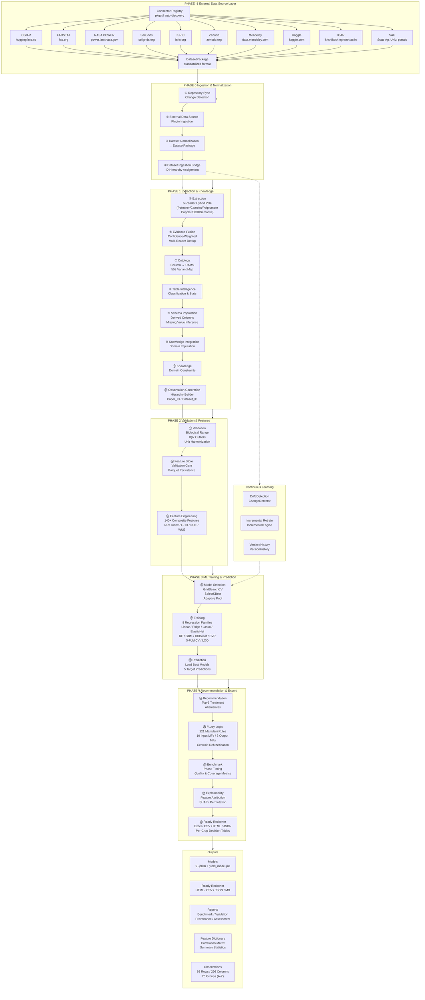

# AAIF Pipeline Flowchart



## Pipeline Summary

| Property | Value |
|----------|-------|
| **Total Agents** | 23 sequential |
| **Pipeline Phases** | 5 (0–4) + PHASE -1 (External Data) |
| **UAMS Schema** | 296 columns, 26 groups (A–Z) |
| **Variant Map** | 553 unique entries |
| **Production Run** | PROD_20260729_134301 — 134.2s, 22/22 agents |
| **Output** | 66 observations, 9+1 trained models |
| **Fuzzy Rules** | 221 Mamdani (v3.0) |
| **Model Families** | 8 regression (Linear, Ridge, Lasso, ElasticNet, RF, GBM, XGBoost, SVR) |

## Data Flow Legend

```
Solid arrow  ──►  Required sequential flow
Dotted arrow  ~~►  Optional / conditional flow
```
